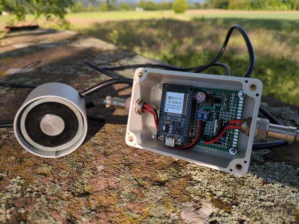
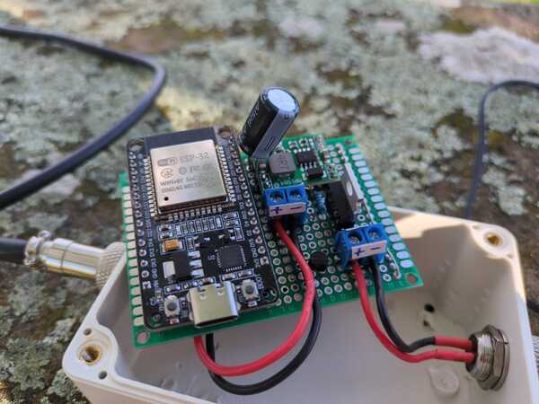
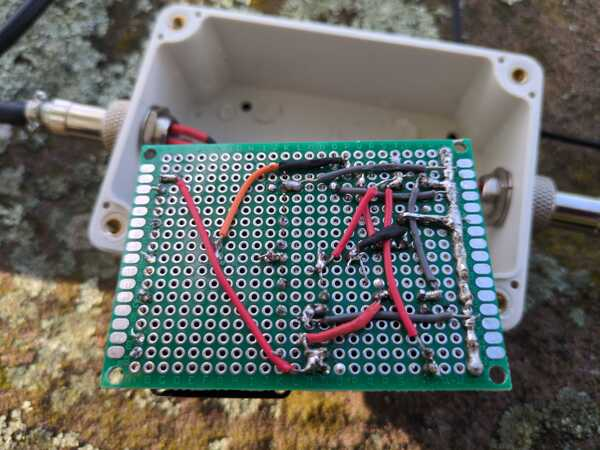
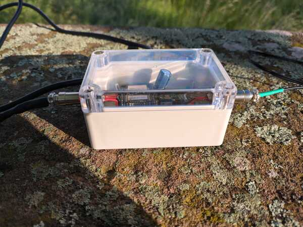
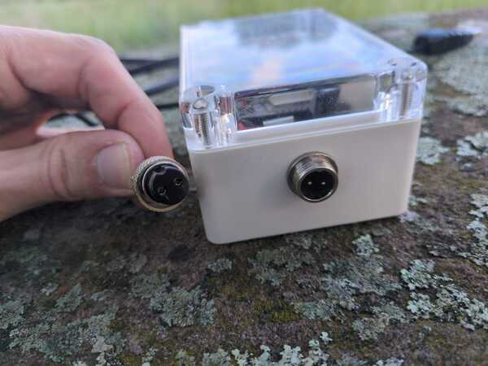
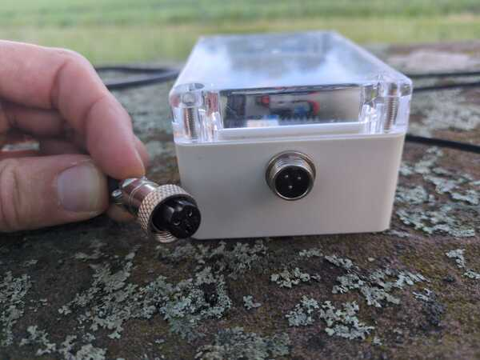
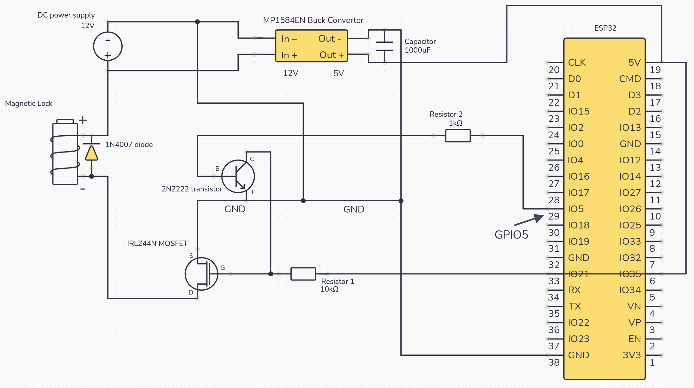
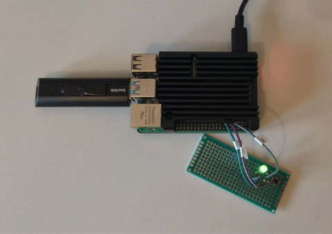

# lock88 – Self-Bondage Lock Controller

An open-source self-bondage controller for you to build. Generate a one-time password, give it away, and earn each second back the hard way.

At the heart of lock88 is a chunky electromagnet: the [MagBound Magnetic Lock](https://ageofbondage.com/products/magbound-premium-magnetic-time-lock-aluminium), the squat metal cylinder in the first photo below, clamping a steel plate shut with enough force you're not pulling it open. What you bolt it to is entirely up to you: a box holding the keys to your handcuffs, a chain wound around your wrists, the latch on the cage you climbed into, the drawer your phone is in. The twist that sets this apart from the original Smart Timer: engaging the lock generates a one-time password, shown exactly once, with no way to retrieve it after. Hand it straight to a Raspberry Pi you physically can't reach — which is, of course, the entire point. You're not going anywhere until the timer runs out, or until you win enough seconds back through games to let yourself out early. Or hand the password to someone else, and let *them* decide when you're done.

The [MagBound Smart Timer](https://ageofbondage.com/products/magbound-smart-timer) is a great little controller box: plug the magnetic lock into it, set a countdown, and the lock releases when the timer hits zero. I've used one for years, and a one-time password is the one thing I always dreamt it could do. lock88 is a reimplementation built around an ESP32 and a Raspberry Pi, with that password-authenticated HTTPS API at its core. Everything else grew from there: a game framework that doesn't always let you win, configurable penalties and rewards, built-in games.

**Quick links:** [CLI & API reference](docs/lock_client.md) · [Circuit diagram](#how-to-build-this) · [The Game Environment](#the-game-environment) · [Building a Game Plugin](docs/game_plugins.md)

<table>
  <tr>
    <td><a href="media/title.jpg"></a></td>
    <td><a href="media/perfboard.jpg"></a></td>
    <td><a href="media/perfboard_back.jpg"></a></td>
  </tr>
  <tr>
    <td><a href="media/side_view.jpg"></a></td>
    <td><a href="media/plug-2.jpg"></a></td>
    <td><a href="media/plug-3.jpg"></a></td>
  </tr>
</table>

## Demo

https://github.com/user-attachments/assets/613fa588-7d4f-4cd2-b1a3-dd305e1226b9

<i>"Are You Watching?" — one of the games. The better the video, the more dots you miss, the longer you stay locked.</i>

## Features & Improvements over the MagBound Smart Timer

- **One-time password** — shown exactly once when you lock, gone forever after that. No way to retrieve it, no way to cheat. This is the whole reason lock88 exists.
- **Encrypted transport** — HTTPS with a self-signed certificate pinned to the ESP32. The private key is generated at setup and never leaves the ESP32. Go ahead and sniff the traffic – there is nothing to find.
- **A game framework** — win time back (or lose it) by playing games. Fully extensible and pluggable: drop a new plugin folder in and it appears automatically.
- **Flexible time input** — set durations the way you think about them: relative like `+1h` or `1h30m`, or an absolute wall-clock time like `20:30`
- **Survives network glitches** — WiFi drops mid-request, you retry, nothing gets counted twice. Lost responses, repeated commands, the Pi reconnecting after a router reboot: the system handles all of it.
- **Free and open-source** — build whatever you want on top of it.
- **No OTA firmware updates** — the original Smart Timer can be reflashed over the network, which means it can be unlocked by reflashing. lock88 doesn't support OTA. What's locked stays locked.
- **Secure connectors** — aviation plugs instead of DC barrel jacks – the cables are secured to the device with a screw and can't be pulled out.
- **No high-pitched sound** on lock/unlock.

## How Does the Password Authentication Work?

When you engage the lock, you set two things:

- **Initial lock time**: where the countdown starts
- **Maximum lock time**: an absolute ceiling the timer can never exceed, no matter what

The ESP32 immediately generates a cryptographically random one-time password and returns it **once**. After that it's gone. There's no endpoint to retrieve it, no recovery flow, nothing. You hand over control and that's it.

If you have the password, you can unlock early or adjust the remaining time (up or down, but never past the maximum). If you don't have it, you wait — which is the point.

In practice, the Raspberry Pi (the game server) holds the password in RAM. You physically can't access the Pi, so you genuinely can't cheat. And if you locked via the web interface, you never even saw the password to begin with. It went straight from the ESP32 into the Pi's RAM without appearing on your screen.

But here's where it gets more interesting. The Raspberry Pi isn't just holding the password. It's running a full **game framework**. Win time back (or lose it) by playing games: the Pi mediates every round, enforces the outcome, and adjusts the countdown accordingly. You're the one who chooses to play. The house doesn't always let you win.

Or let a **partner** run the show entirely. They can engage the lock, set the time, and keep the password. You never see it. From that moment on, *they* call the shots: let you out early if they're feeling generous, pile on more time if they're not, or simply enjoy knowing you're going nowhere until they decide otherwise. All they need is access to the local network — or a tool like [Tailscale](https://tailscale.com/) if they're holding your keys from across town.

The Pi–ESP32 channel is encrypted with HTTPS. The ESP32's TLS private key is generated once at setup and deleted from your computer immediately. So even with full access to your local network and router, sniffing the traffic gets you nothing.

One more thing worth knowing: if the ESP32 loses power for any reason, the lock releases immediately and stays released. It does not re-engage when power is restored.

## ⚠️ This Can Trap You ⚠️

This device is intended to restrict your freedom of movement for a set period of time.<br>
**Used incorrectly, it can trap you in a situation you cannot escape from.**

By using this project, you accept that:

- You are solely responsible for your own safety and the safety of others.
- You must always have a reliable emergency secondary release mechanism.
- You must **only use a power bank** for powering the device. If the ESP32 loses power, the lock releases immediately and stays released — it does not re-engage even if power were somehow restored. This makes the power bank your emergency escape: when it runs out, you're out. Never connect directly to mains power.
- This software and hardware design is provided as-is, without any warranty. The author accepts no liability for any harm, injury, or damage arising from its use.

**Never use this device in a way that could prevent you from calling for help in an emergency.**

## What You Need

- [MagBound Magnetic Lock](https://ageofbondage.com/products/magbound-premium-magnetic-time-lock-aluminium)
- [ESP32](https://amzn.eu/d/07gdlals) – I picked the DevKit V1 USB-C. Any standard ESP32 development board (WROOM/WROVER-based) will work — the firmware uses GPIO 5, so just wire to whichever physical pin on your board corresponds to GPIO 5.
- Raspberry Pi — any model works (the author uses a Pi 4). Or any other spare computer on your network that you can stash out of reach and go dark on over SSH
- USB charger DTC-5101 – converts 5V USB to 12V for the magnet – get it [here](https://ageofbondage.com/products/usb-adapter-for-05821) or [here](https://www.akku-wechsel.de/shop/spannungswandler-usb-von-5-volt-auf-auf-12-volt-passend-fur-akku-ladegerat-dtc-5101.html)
- [Buck converter MP1584EN](https://amzn.eu/d/08iOfTGn)
- [MOSFET IRLZ44N](https://amzn.eu/d/0aIqyGMR)
- [Diode IN4007](https://amzn.eu/d/0a9K10r3)
- Transistor 2N2222
- Capacitor 1000µF (10V or higher)
- Resistor 1kΩ
- Resistor 10kΩ
- GX12 Aviation plugs — I got a [2-Pin plug for the power-side](https://amzn.eu/d/06T5v2Q5) and a [3-Pin plug for the magnet-side](https://amzn.eu/d/0gw43LP0) so I don't confuse the input/output
- [Case](https://amzn.eu/d/0eeQJ0Qy) (or even better a 3D printer if you have one)
  - [Step drill bit for drilling the two holes in the case](https://amzn.eu/d/08Gg2OW4)
- Perfboard
- Cables of various colours (or white cables and coloured Sharpie markers)
- Multimeter
- Soldering iron
- Nail varnish
- [Wago connectors (useful if you want to build a prototype)](https://amzn.eu/d/03I0rsXv)

For the Raspberry Pi's SSH toggle (just nice-to-have and optional):
- LED
- [6 x 6mm tactile pushbutton](https://amzn.eu/d/0gF7QCIr)
- Resistor between 100Ω and 150Ω

## How to Build This

<a href="media/circuit.png"></a>
<sub><i>(drawn with [Circuit Canvas](https://circuitcanvas.com))</i></sub>

**Why a 2N2222 is needed:** the IRLZ44N is sold as a logic-level MOSFET, but at the ESP32's 3.3V GPIO it doesn't quite fully turn on. The resulting on-resistance is high enough that the lock current heats the MOSFET noticeably. The 2N2222 inverts the GPIO signal and drives the gate the full 0V to 5V instead, which collapses the on-resistance to its rated value and keeps the MOSFET cool. The inversion is intentional and the firmware is written to match: GPIO 5 HIGH pulls the gate low, MOSFET off, lock unlocked.

About the plugs: the original magnetic lock uses 5.5 x 2.1 mm DC adapters [like this one](https://amzn.eu/d/0aaEWyAC), but I don't like that they can be pulled out under a bit of tension. The aviation plugs fix that problem, but to use them you have to cut the original cable of the MagBound Lock and solder on the aviation connector. It's your call to decide if you are comfortable doing that or whether you want to get the 5.5 × 2.1 mm DC adapters instead.

⚠️ The buck converter's output **must** be set to 5V. Adjust the screw on the buck converter while monitoring the output with a multimeter, aiming for between 4.8 V and 5.2 V. Once set, put a drop of nail varnish on the screw to keep it in place.

## Repository Structure

```
lock88/
├── esp32/          # MicroPython firmware for the ESP32 lock controller
│   ├── main.py     # HTTPS server, lock state machine, countdown loop
│   └── config.py   # WiFi credentials and settings
│
├── docs/           # Documentation
│   └── lock_client.md                # ← Full CLI & API reference
│
├── setup-tls.sh    # One-time TLS provisioning script (run from any computer with USB access to the ESP32)
│
└── pi/             # Raspberry Pi game server and lock client
    ├── game_server.py          # Flask server, game plugin orchestration
    ├── lock_client.py          # ESP32 HTTPS client and CLI tool
    ├── ssh_toggle.py           # Script to enable/disable SSH access
    ├── config                  # Pi-side configuration
    └── games/                  # Game plugins (one subdirectory each)
```

## Software Setup

> These instructions are written for Linux and tested on Linux only. The Raspberry Pi runs Linux, so the Pi side is fine as-is. For the ESP32 flashing step, Windows and macOS users will need to adjust the port (`/dev/ttyUSB0` → `COM3`, `/dev/tty.usbserial-*`, etc.) — the rest should work the same.

### ESP32 Firmware

The ESP32 firmware is written in MicroPython. You need to flash MicroPython onto the ESP32 before copying the firmware files.

1. **Flash MicroPython** onto the ESP32 using `esptool`. Download the latest `.bin` for ESP32 from [micropython.org/download/ESP32_GENERIC](https://micropython.org/download/ESP32_GENERIC/), then:

   ```bash
   pip install esptool
   esptool.py --port /dev/ttyUSB0 erase_flash
   esptool.py --port /dev/ttyUSB0 --baud 460800 write_flash -z 0x1000 ESP32_GENERIC-<version>.bin
   ```

2. **Edit `esp32/config.py`**:

   ```python
   # SSID of the WiFi network the ESP32 should connect to.
   WIFI_SSID = ""

   # Password for the WiFi network.
   WIFI_PASSWORD = ""

   # Whether to mirror lock state to the onboard LED (GPIO 2).
   # 1 = LED on while locked, off while unlocked. 0 = LED unused.
   LED_ON_LOCK = 1

   # Seconds after a random lock during which GET /status hides remaining_seconds.
   # The lock is fully active and the timer can be adjusted
   # Only the countdown is concealed. 0 = no blind period.
   RANDOM_BLIND_SECS = 120
   ```

3. **Upload the firmware files** to the ESP32 using Thonny, `mpremote`, or `ampy`:

   ```bash
   mpremote cp esp32/main.py :main.py
   mpremote cp esp32/config.py :config.py
   ```

4. **Provision TLS** — run the setup script from the repo root (requires `openssl` and `mpremote`):

   ```bash
   ./setup-tls.sh
   ```

   This generates a self-signed certificate and EC private key, uploads both to
   the ESP32, then immediately deletes the private key from your computer. The
   certificate is kept as `esp32_cert.pem` — you'll need it in the next step.

5. Reset the ESP32. It will connect to WiFi and start the HTTPS server on port 443.

   > **Note the IP address** shown in the serial output — you'll need it in the next section when setting `BASE_URL` in `pi/config`.

### Raspberry Pi Server

**Why a Raspberry Pi?** It doesn't have to be — any spare computer on your home network will do. The requirements are simple: you can't physically reach it while locked, and you're willing to cut off SSH access for the duration. The game server stores the ESP32 password in RAM, and RAM is readable by anyone with admin access to the machine. A machine you *can't* reach is a machine you *can't* cheat. The Pi is just a popular choice: small, cheap, and easy to stash somewhere. Any model works, the author uses a Pi 4. I wired a button and an LED to my Pi that toggle its SSH server — press before locking to go dark, press again when you need back in.



1. **Install dependencies** (Python 3.10+):

   ```bash
   python3 -m venv pi/.venv
   pi/.venv/bin/pip install flask requests pyyaml
   pi/.venv/bin/pip install anthropic  # optional, only needed for the Proof of Work game

   sudo apt install ffmpeg  # optional, only needed for the "Are you watching?" game
   ```

2. **Copy the `pi/` directory** to the Raspberry Pi, then edit `pi/config`. Set `BASE_URL` to the ESP32's IP address from the previous section:

   ```
   BASE_URL=https://192.168.x.x   # ← set this to the ESP32's IP
   CERT_PATH=                     # filled in by step 4
   VERIFY_TOLERANCE_SECS=5        # clock-sync tolerance between Pi and ESP32
   RANDOM_START_PERCENT=50        # starting point (%) for random-mode locks
   ```

   See `pi/config` for documentation on all keys.

3. **Make `lock_client.py` executable:**

   ```bash
   chmod +x pi/lock_client.py
   ```

   `lock_client.py` is the command-line interface to the ESP32 — it handles locking, unlocking, time adjustments, and TLS setup. It can run on the Pi or on any other machine that can reach the ESP32. The remaining setup steps use it; see the [full CLI & API reference](docs/lock_client.md) for every command.

4. **Pin the TLS certificate** — run once on every machine that will use `lock_client.py`:

   ```bash
   pi/lock_client.py setup-tls
   ```

   This connects to the ESP32 once without verification, saves the certificate,
   and prints the `CERT_PATH` line to add to `pi/config`.

   The machine where you ran `setup-tls.sh` already has `esp32_cert.pem` and
   can skip this — just set `CERT_PATH` in `pi/config` to point at that file.

5. **Start the server:**

   To test it manually:

   ```bash
   cd pi
   .venv/bin/python game_server.py
   ```

   For a permanent install, create a user systemd unit. Save the following as `~/.config/systemd/user/lock88.service` (adjust `WorkingDirectory` and `ExecStart` to match your path):

   ```ini
   [Unit]
   Description=Lock88 game server
   After=network.target

   [Service]
   Type=simple
   WorkingDirectory=/path/to/pi
   ExecStart=/path/to/pi/.venv/bin/python3 /path/to/pi/game_server.py
   Restart=on-failure
   RestartSec=5
   Environment=PYTHONUNBUFFERED=1

   [Install]
   WantedBy=default.target
   ```

   Then enable and start it:

   ```bash
   systemctl --user daemon-reload
   systemctl --user enable --now lock88
   loginctl enable-linger
   ```

   `enable-linger` ensures the service starts at boot even before you log in.

   The server runs on port 5000 and is accessible on your local network.
   Once it's running, disable SSH — that's what keeps you honest.
   You can use [this script](pi/ssh_toggle.py) which utilises a button: short press to toggle the SSH state, long press to power off the Pi. Wire a button to GPIO 17 (BCM, to GND) and an LED to GPIO 27 (BCM, active-high) — the LED mirrors the SSH state. Install the `gpiozero` dependency via apt so it is available to the system Python:

   ```bash
   sudo apt install python3-gpiozero
   ```

   To run it at boot, copy `ssh_toggle.py` to `/usr/local/bin/`, then save the following as `/etc/systemd/system/ssh-toggle.service`:

   ```ini
   [Unit]
   Description=SSH Toggle Button

   [Service]
   ExecStart=/usr/bin/python3 /usr/local/bin/ssh_toggle.py
   Restart=always
   RestartSec=3
   User=root

   [Install]
   WantedBy=multi-user.target
   ```

   Then enable and start it:

   ```bash
   sudo systemctl daemon-reload
   sudo systemctl enable --now ssh-toggle
   ```

## Usage

### Web Interface

Open `http://<pi-ip>:5000` in your browser. The page shows a lock control panel and the list of available games.

**To lock:**
Fill in the initial duration and maximum duration, then click **Lock**. A one-time password is generated by the ESP32 and stored in the Pi's RAM — you won't see it. You can now play games.

**Alternatively, lock from the CLI** (on any machine that can reach the ESP32 and has the TLS certificate pinned — see [TLS setup](#raspberry-pi-server)), then enter the password in the browser:

```bash
lock_client.py pass-lock
# Enter initial duration: 1h
# Enter maximum duration: 3h
# Password: 4f3a...  ← shown once; delete it from your terminal history
```

Open the browser, paste the password into the password field, and click **Set Password**.

**To unlock:**
Win enough time back through games, wait for the timer to reach zero, or click **Unlock** (requires the password to be set).

### CLI

> **📝 [lock_client.py — Command & API Reference](docs/lock_client.md)**<br>
> Complete documentation of every CLI command and Python API, with examples.

`lock_client.py` can be used standalone from any machine that can reach the ESP32 directly (without needing the game server):


```bash
# Check lock state
lock_client.py status

# Engage pass-lock (prompts for durations)
lock_client.py pass-lock

# Subtract 30 minutes from the remaining time
lock_client.py pass-adjust -30m <password>

# Add time (cannot exceed the maximum lock time set at lock time)
lock_client.py pass-adjust +1h <password>

# Unlock immediately
lock_client.py pass-unlock <password>
```

**Duration formats:** `90` (seconds), `90m`, `1h`, `1h30m`, `1h30m45s`, or a wall-clock time like `20:30` (locks until 20:30 today, or tomorrow if that time has passed).

## The Game Environment

The game server runs on the Raspberry Pi and serves a web-based game framework. Winning a game subtracts a pre-defined reward from the remaining lock time. Starting a game (and not winning) adds a penalty — but the maximum lock time is never exceeded.

The penalty lands the moment you click **Attempt a game** — close the tab, forget it exists, it doesn't matter. It already happened. The only exception is Proof of Work, which holds off until after evaluation.

### Building a Game Plugin

The game framework is fully pluggable. Each game is a self-contained directory under `pi/games/` with a Python backend, a JavaScript frontend, a stylesheet, and a config file. Drop the directory in, restart the server, and the new game appears in the selector alongside the built-in ones. No changes to any framework file are required.

> **📝 [Building a Game Plugin — full guide](docs/game_plugins.md)**<br>
> Step-by-step walkthrough of the four files, the rules the framework expects, and a complete minimal game (Guess the Number) you can drop in and run.

#### Controlling display order and disabling games

`pi/games/games.conf` lists game IDs in display order, one per line. To disable a game, wrap its ID in square brackets:

```
watching
wordle
hangman
[2048]
```

Games not listed are enabled and appear alphabetically after the listed ones. Lines starting with `#` and blank lines are ignored.

## Games Currently Available

### Are You Watching?

My favourite. The game wants proof you're actually watching: bright dots flash up over the video at random intervals, and you click each one before it vanishes. Fill the folder with whatever pulls you in. The better the video, the more dots slip past. 

[See the demo here](#demo)

**Configuration:** `pi/games/watching/config`

| Key | Description |
|-----|-------------|
| `ATTEMPT_PENALTY_SECONDS` | Seconds added on attempt |
| `WIN_REWARD_SECONDS` | Seconds removed on win |
| `MIN_DOT_INTERVAL_SECONDS` | Shortest gap between dots |
| `MAX_DOT_INTERVAL_SECONDS` | Longest gap between dots (interval is random in this range) |
| `DOT_TIMEOUT_SECONDS` | Seconds to click a dot before it counts as missed |
| `MAX_MISS_PERCENT` | Maximum percentage of missed dots that still counts as a win |
| `SEGMENT_DURATION_SECONDS` | Length of the video segment to watch; set to 0 to require the full video |
| `VIDEO_DIR` | Directory containing video files |

Add video files (MP4, WebM, MKV, MOV, AVI) to the directory pointed to by `VIDEO_DIR`. The list is re-read on each new game — no game server restart needed.

### Wordle

Five letters, six tries, green/yellow/grey. You know the drill. The word list isn't trying to be kind.

**Configuration:** `pi/games/wordle/config`

| Key | Description |
|-----|-------------|
| `ATTEMPT_PENALTY_SECONDS` | Seconds added on attempt |
| `WIN_REWARD_SECONDS` | Seconds removed on win |
| `STRICT_MODE` | When true, only words in `allowed-guesses` are accepted as guesses |

**Word list:** `pi/games/wordle/wordle-list` — one word per line; the answer is chosen from this file. When `STRICT_MODE=true`, `pi/games/wordle/allowed-guesses` is also loaded as the dictionary of valid guesses (answers are always accepted regardless). Restart the server after editing either file.

### Hangman

One letter at a time. Every wrong guess adds another piece to the figure on the gallows.

**Configuration:** `pi/games/hangman/config`

| Key | Description |
|-----|-------------|
| `ATTEMPT_PENALTY_SECONDS` | Seconds added on attempt |
| `WIN_REWARD_SECONDS` | Seconds removed on win |
| `MAX_WRONG` | Wrong guesses allowed before losing |

**Word list:** `pi/games/hangman/hangman-list` — one word per line. Restart the server after editing.

### 2048

Slide tiles on a 4×4 grid, merge equal pairs, work your way up to 2048 (or a custom target).

**Configuration:** `pi/games/2048/config`

| Key | Description |
|-----|-------------|
| `ATTEMPT_PENALTY_SECONDS` | Seconds added on attempt |
| `WIN_REWARD_SECONDS` | Seconds removed on win |
| `WIN_TARGET` | Tile value that triggers a win — lower to make it easier (e.g. 512) |

### Proof of Work

Pick a task — maths problems, a diary entry, a tidy room, a chapter of your master thesis. Do the work, upload your proof, and an Anthropic LLM grades it. It isn't easily impressed. A clean submission cuts your time; a slapdash one piles it on, proportional both ways: nail it for the full reduction, hand in nothing for the full penalty. Ever wished you could just keep sitting while writing your master thesis? Now you have to. Until it gets really good.

**Configuration:** `pi/games/proofofwork/config`

| Key | Description |
|-----|-------------|
| `ANTHROPIC_API_KEY` | Anthropic API key for task generation and evaluation |
| `LLM_MODEL` | Claude model to use (default: `claude-haiku-4-5-20251001`) |
| `EVALUATION_THRESHOLD` | Minimum score (%) for a "good" outcome; below this adds time instead |

> **Cost note:** Evaluating a submission uses very few tokens — a single evaluation costs a fraction of a cent. $5 of API credit goes a long way and covers roughly 500–1,000 evaluations. Sign up and add credit at [console.anthropic.com](https://console.anthropic.com).

**Tasks:** `pi/games/proofofwork/tasks/` — one YAML file per task. Each file defines the subject, the maximum time reduction on a good submission, the maximum time addition on a bad one, and the questions or criteria the LLM scores against. To control task order or disable a task, edit `pi/games/proofofwork/tasks.conf` – a task can be disabled by placing its ID in square brackets (behaves just like `pi/games/games.conf`). Restart the server after adding or editing task files.

> 📝 **[Proof of Work — How to Write Your Own Tasks](docs/proofofwork_tasks.md)**<br>
> Every field you can put in a task file, what it does, and two complete worked examples.

A minimal task YAML:

```yaml
subject: Mathematics – Algebra
max_time_reduction: 1200   # seconds
max_time_addition: 600
tasks:
  - title: Algebra Problems
    generate: "Create 5 algebra problems for a student aged 14–16."
    generate_count: 5
  - title: Your Working
    player_notes: "Write your full working and final answer for each problem."
```

### Vocabulary Trainer

Pick a language file. The prompt is in your language; type the foreign word. Type a wrong one and the round pauses to show you the correct answer. That language you've been meaning to learn — and a lock that finally makes you sit through it.

**Configuration:** `pi/games/vocabulary/config`

| Key | Description |
|-----|-------------|
| `ATTEMPT_PENALTY_SECONDS` | Seconds added on attempt |
| `WIN_REWARD_SECONDS` | Seconds removed on win |
| `WIN_ACCURACY_PERCENT` | Minimum accuracy to win — 75 means at most 25% of answers may be wrong |

**Word files:** `pi/games/vocabulary/word-couples/` — one file per language or topic. Plain text, one pair per line, pipe-separated:

```
bonjour|hello
merci|thank you
```

Files are read at the start of each game — no server restart needed.


## Legal & Attribution

This project is an independent, original implementation of a smart timer
for use with magnetic time locks (including the AgeOfBondage MagBound
Premium Magnetic Time Lock). It is not affiliated with, endorsed by, or
derived from any product or source code by AgeOfBondage or any other
manufacturer.

The hardware design is based on an ESP32 microcontroller and other
commonly available components. The firmware was written from scratch.
While this device is functionally compatible with the AgeOfBondage
magnetic lock, it shares no code, schematics, or design files with the
MagBound Smart Timer or any other commercial product.

"MagBound" is a trademark of AgeOfBondage. Its use here is solely for
compatibility reference under nominative fair use.

This project is released under the GNU General Public License v3. See [LICENSE](LICENSE)
for details.
